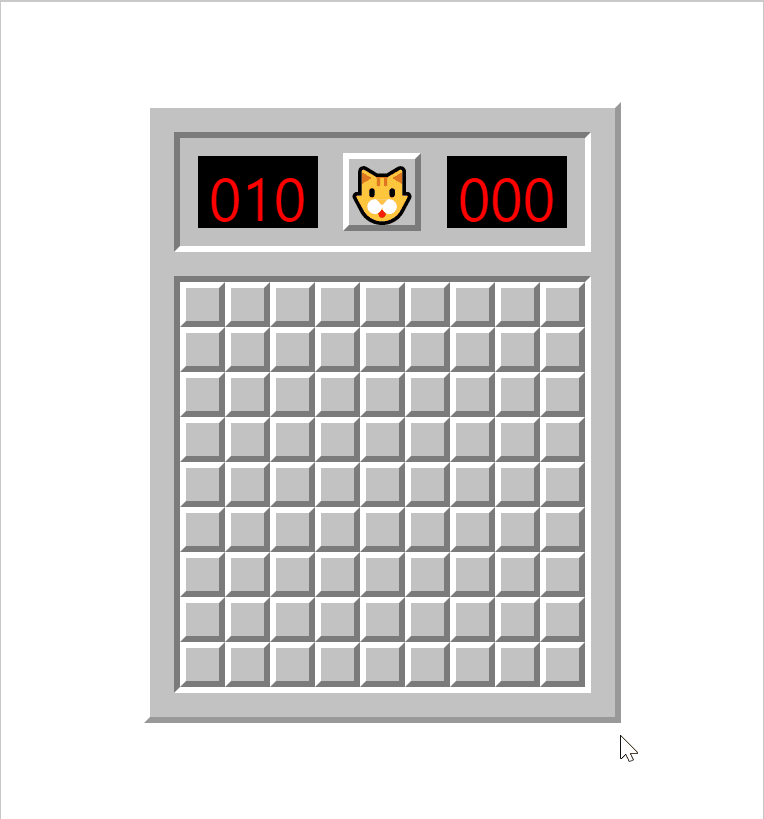
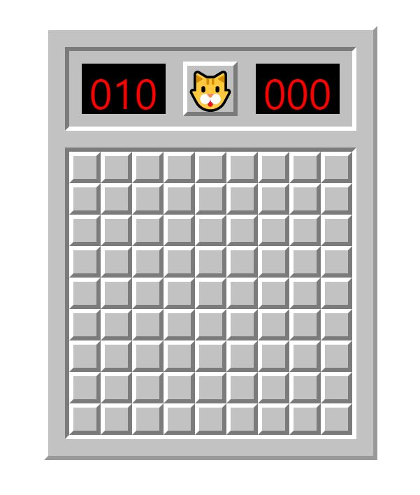

# CatSweeper 🐱🧶 A Node, Express, React, Typescript, Sass App  

CatSweeper is a twist on the classic game minesweeper. This single-player puzzle game allows users to play on easy mode and 
clear the board without uncovering the 10 yarns. Users can also place 10 fishing poles on the board to mark where a yarn may be hiding.

# Deployed Application

Try it out!
[CatSweeper](https://cat-sweeper.herokuapp.com/)

# User Story

> As a USER, I want to play the game minesweeper, but with cats!

# Acceptance Criteria

```
GIVEN I want to play a feline version of minesweeper
WHEN I open the app
THEN I will be presented with a classic minesweeper board, but with a cat face, yarns, and fishing poles

GIVEN I want to win
WHEN I click on all squares without revealing a yarn
THEN I will see the excited cat face

```

# Technologies Used:
- Express
- Heroku
- HTML & CSS
- Node.js
- NPM:
  - concurrently
  - eslint-config-prettier
  - express
  - nodemon
- React
- Sass
- TypeScript

# Preview

>

>